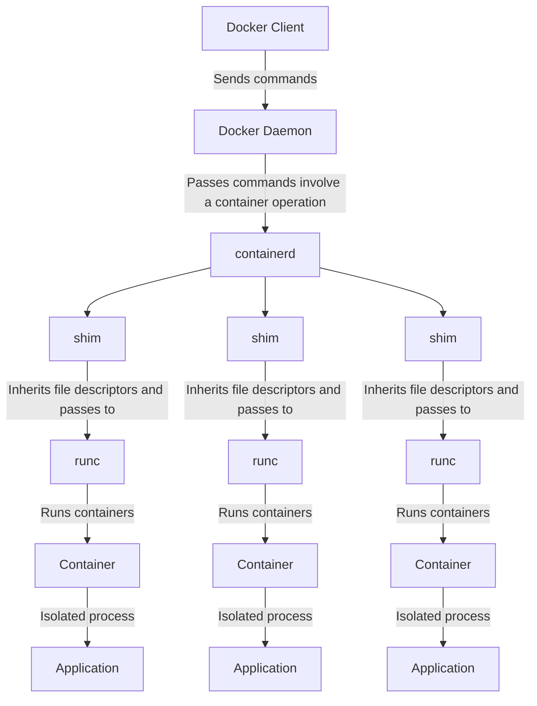

# Docker Arctecture

## Docker Engine

1. **Client**: represented by the `docker` command in the terminal, which is used to interact with the Docker daemon.

2. **Docker Daemon**: The Docker daemon `dockerd` receives commands from the Docker client and manages Docker objects such as images, containers, networks, and volumes. When a command involves a container operation, it passes the command to `containerd`.

    ```bash
        $ ps -aux | grep dockerd
        root        1382  0.5  1.1 2504732 90544 ?       Ssl  05:39   0:48 /usr/bin/dockerd -H fd:// --containerd=/run/containerd/containerd.sock
    ```

3. **containerd**: `containerd` is a runtime that manages the complete container lifecycle: image transfer and storage, container execution, supervision, and networking. It checks if the image is in the local cache, if not, it pulls it from the Docker registry. It then prepares the container for running and hands off control to `runc`.

    ```bash
        $ ps -aux | grep containerd
        root         998  0.0  0.5 2094264 44604 ?       Ssl  05:39   0:07 /usr/bin/containerd
        root        1382  0.5  1.1 2504732 90544 ?       Ssl  05:39   0:48 /usr/bin/dockerd -H fd:// --containerd=/run/containerd/containerd.sock
    ```

4. **shim**: `containerd-shim` is a component that is created for each running container to ensure that `containerd` itself can be stopped and restarted without affecting running containers. It's a bridge between `containerd` and `runc`, inheriting the file descriptors from `containerd` and passing them to `runc`.

5. **runc**: `runc` is a lightweight, portable container runtime that spawns and runs containers. For each container, it runs a process in a container and is responsible for running, stopping, and deleting containers.


