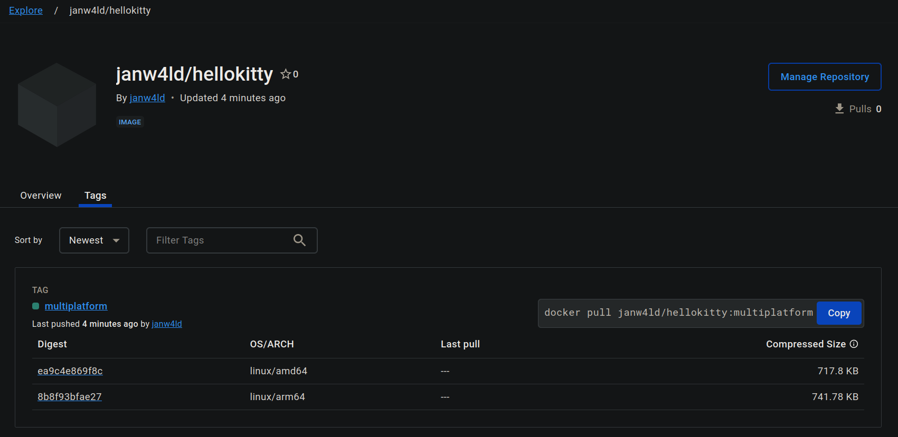

# Buildkit

[moby/buildkit](https://github.com/moby/buildkit) is a newer cache-efficient
build system for Dockerfiles, it also provides more advanced features for builds
and cache management. Buildkit comes bundled with new Docker versions as the
subcommand `buildx`, we'll be using `docker buildx` to compile our
`HelloKittyexe` project for multiple architecture targets.

## but why??

building to multiple different platforms makes it easy to distribute software
to single-board computers and other embedded linux devices with unpopular
architectures, it also makes it easier to compile for devices with underpowered
hardware, like a Raspberry Pi, locally (& conveniently) in a more powerful dev
environment

## prerequisites

Docker virtualisation depends on

1. `qemu` and `binfmt_misc` support in the kernel, most modern kernels support
   these features out of the box.
1. `binfmt-support` >= 2.1.7, which can be installed on Debian-based systems
   with `apt install binfmt-support`.
1. registering `qemu` interpreters for the target architectures, by running
   `docker run --privileged --rm tonistiigi/binfmt --install linux/arm64`

## building for multiple architectures

we can build our project for multiple architectures with no modifications to the
Dockerfile

```console
$ docker buildx build --platform=amd64,arm64 -t hellokitty:multiplatform .
[+] Building 2.0s (30/30) FINISHED                                                                                                     docker-container:priceless_ardinghelli
 => [internal] load build definition from Dockerfile                                                                                0.0s
 => => transferring dockerfile: 340B                                                                                                0.0s
 => [linux/arm64 internal] load metadata for docker.io/library/alpine:3.19                                                          1.7s
 => [linux/amd64 internal] load metadata for docker.io/library/alpine:3.19                                                          1.7s
 => [auth] library/alpine:pull token for registry-1.docker.io                                                                       0.0s
 => [internal] load .dockerignore                                                                                                   0.0s
 => => transferring context: 2B                                                                                                     0.0s
 => [internal] load build context                                                                                                   0.0s
 => => transferring context: 63B                                                                                                    0.0s
 => [linux/amd64 builder 1/8] FROM docker.io/library/alpine:3.19@sha256:c5b1261d6d3e43071626931fc004f70149baeba2c8ec672bd4f27761f8e1ad6b  0.1s
 => => resolve docker.io/library/alpine:3.19@sha256:c5b1261d6d3e43071626931fc004f70149baeba2c8ec672bd4f27761f8e1ad6b                0.1s
 => [linux/arm64 builder 1/8] FROM docker.io/library/alpine:3.19@sha256:c5b1261d6d3e43071626931fc004f70149baeba2c8ec672bd4f27761f8e1ad6b  0.1s
 => => resolve docker.io/library/alpine:3.19@sha256:c5b1261d6d3e43071626931fc004f70149baeba2c8ec672bd4f27761f8e1ad6b                0.1s
 => CACHED [linux/amd64 builder 2/8] RUN apk add --no-cache   make   cmake                                                          0.0s
 => CACHED [linux/amd64 builder 3/8] RUN apk add --no-cache   g++                                                                   0.0s
 => CACHED [linux/amd64 builder 4/8] WORKDIR /src                                                                                   0.0s
 => CACHED [linux/amd64 builder 7/8] RUN CXX=g++ cmake .                                                                            0.0s
 => CACHED [linux/amd64 builder 8/8] RUN make                                                                                       0.0s
 => CACHED [linux/amd64 stage-1 1/1] COPY --from=builder /src/HelloKittyexe /app/HelloKittyexe                                      0.0s
 => CACHED [linux/amd64 builder 5/8] COPY --link CMakeLists.txt .                                                                   0.0s
 => CACHED [linux/amd64 builder 6/8] COPY --link main.cpp .                                                                         0.0s
 => CACHED [linux/arm64 builder 2/8] RUN apk add --no-cache   make   cmake                                                          0.0s
 => CACHED [linux/arm64 builder 3/8] RUN apk add --no-cache   g++                                                                   0.0s
 => CACHED [linux/arm64 builder 4/8] WORKDIR /src                                                                                   0.0s
 => CACHED [linux/arm64 builder 7/8] RUN CXX=g++ cmake .                                                                            0.0s
 => CACHED [linux/arm64 builder 8/8] RUN make                                                                                       0.0s
 => CACHED [linux/arm64 stage-1 1/1] COPY --from=builder /src/HelloKittyexe /app/HelloKittyexe                                      0.0s
 => CACHED [linux/arm64 builder 5/8] COPY --link CMakeLists.txt .                                                                   0.0s
 => CACHED [linux/arm64 builder 6/8] COPY --link main.cpp .                                                                         0.0s
WARNING: No output specified with docker-container driver. Build result will only remain in the build cache. To push result image into registry use --push or to load image into docker use --load
```

notice the WARNING after the build, `buildkit` creates multiplatform images in a
format not yet supported by docker (a manifest list), trying to `--load` an
images into the docker registry by default -similar to the legacy builder
behaviour- will error out. so we need to use `--push` to export the
multiplatform image to an external registry that supports manifest lists.

we'll use dockerhub for this example, our prerequisites now are

- creating an account on [hub.docker.com](https://hub.docker.com)
- creating a dockerhub personal access token with `write` permissions,
  [guide](https://docs.docker.com/security/for-developers/access-tokens/)
- creating a repository on dockerhub,
  [guide](https://docs.docker.com/docker-hub/repos/create/), we'll name the repo
  `hellokitty`

after creating the account, the access token and the repo, we'll login to the docker cli
with this token

```console
$ docker login -u janw4ld
Password: <paste token here>

Login Succeeded
```

then build the image with the `--push` flag, we'll have to prepend the account's
username to the image name to be `janw4ld/hellokitty`

```console
$ docker buildx build --platform=amd64,arm64 -t janw4ld/hellokitty:multiplatform . --push
[+] Building 12.1s (31/31) FINISHED                                                               docker-container:priceless_ardinghelli
 => [internal] load build definition from Dockerfile                                                                                0.0s
 => => transferring dockerfile: 340B                                                                                                0.0s
 => [linux/arm64 internal] load metadata for docker.io/library/alpine:3.19                                                          0.9s
 => [linux/amd64 internal] load metadata for docker.io/library/alpine:3.19                                                          0.9s
 => [internal] load .dockerignore                                                                                                   0.0s
 => => transferring context: 2B                                                                                                     0.0s
 => [internal] load build context                                                                                                   0.0s
 => => transferring context: 63B                                                                                                    0.0s
... snip ...
 => exporting to image                                                                                                             10.8s
 => => exporting layers                                                                                                             0.0s
 => => exporting manifest sha256:ea9c4e869f8c50d54dfbf9a94b66d39705e01dee10ab5043ffc05a0f05ec9d32                                   0.0s
 => => exporting config sha256:24b9a333ae182ef5b519240de2871b0800ecd942d999f59af1f7b97615170f74                                     0.0s
 => => exporting attestation manifest sha256:3430c4fc502a6cf9e3b531331653393e002be9a4b887a7fcfa4ec8fcc316e401                       0.0s
 => => exporting manifest sha256:8b8f93bfae27dd80a7186fc8386a27610fb5491d5354c33a4d09740f470910aa                                   0.0s
 => => exporting config sha256:67581edf904d2d0e6a743303e33c10afd33b2e49942a0f11799b05a69afc2b83                                     0.0s
 => => exporting attestation manifest sha256:ad1e12e02ad92ec7952b3febd734d9b4864cf8ef1f3b8daa6d6f9f179fba1add                       0.0s
 => => exporting manifest list sha256:5c02a57e1321650cd39f0fa46cd2a4ef2cad5bca045c65d355a575e42e03af62                              0.0s
 => => pushing layers                                                                                                               7.8s
 => => pushing manifest for docker.io/janw4ld/hellokitty:multiplatform@sha256:5c02a57e1321650cd39f0fa46cd2a4ef2cad5bca045c65d355a575e42e03af62  2.8s
 => [auth] janw4ld/hellokitty:pull,push token for registry-1.docker.io                                                              0.0s
```

notice [our image on dockerhub](https://hub.docker.com/repository/docker/janw4ld/hellokitty/tags)
is now a multiplatform image



we can also check the available platforms in a manifest list by running

```console
$ docker buildx imagetools inspect janw4ld/hellokitty:multiplatform
Name:      docker.io/janw4ld/hellokitty:multiplatform
MediaType: application/vnd.oci.image.index.v1+json
Digest:    sha256:5c02a57e1321650cd39f0fa46cd2a4ef2cad5bca045c65d355a575e42e03af62

Manifests:
  Name:        docker.io/janw4ld/hellokitty:multiplatform@sha256:ea9c4e869f8c50d54dfbf9a94b66d39705e01dee10ab5043ffc05a0f05ec9d32
  MediaType:   application/vnd.oci.image.manifest.v1+json
  Platform:    linux/amd64

  Name:        docker.io/janw4ld/hellokitty:multiplatform@sha256:8b8f93bfae27dd80a7186fc8386a27610fb5491d5354c33a4d09740f470910aa
  MediaType:   application/vnd.oci.image.manifest.v1+json
  Platform:    linux/arm64

  Name:        docker.io/janw4ld/hellokitty:multiplatform@sha256:3430c4fc502a6cf9e3b531331653393e002be9a4b887a7fcfa4ec8fcc316e401
  MediaType:   application/vnd.oci.image.manifest.v1+json
  Platform:    unknown/unknown
  Annotations:
    vnd.docker.reference.digest: sha256:ea9c4e869f8c50d54dfbf9a94b66d39705e01dee10ab5043ffc05a0f05ec9d32
    vnd.docker.reference.type:   attestation-manifest

  Name:        docker.io/janw4ld/hellokitty:multiplatform@sha256:ad1e12e02ad92ec7952b3febd734d9b4864cf8ef1f3b8daa6d6f9f179fba1add
  MediaType:   application/vnd.oci.image.manifest.v1+json
  Platform:    unknown/unknown
  Annotations:
    vnd.docker.reference.digest: sha256:8b8f93bfae27dd80a7186fc8386a27610fb5491d5354c33a4d09740f470910aa
    vnd.docker.reference.type:   attestation-manifest
```

the `unknown/unknown` platforms are metadata that describe the build process of
the manifest list, they're used for supply-chain security & compliance, no need
to worry about them.

when running a multiplatform image, docker will select the appropriate platform
image and only download that from the list.

## what's next?

the performance overhead of virtualisation can't be glossed over, and builds can
sometimes take as much as 6x the time of a native build, so instead of qemu virt
we'll be looking at using `buildx` alongside
[tonistiigi/xx](https://github.com/tonistiigi/xx) to cross-compile our project
for multiple architectures with all build steps running natively on the host.
cross-compilation can be achieved on a build tooling level with CMake, but the
`buildx` approach is simpler and more flexible.

